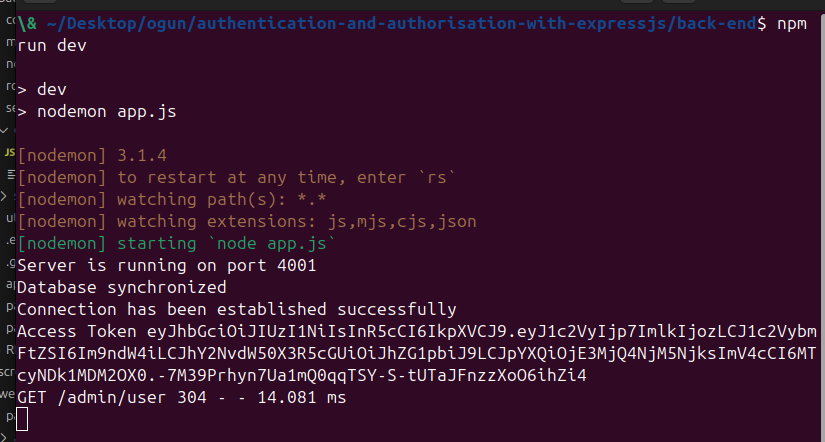
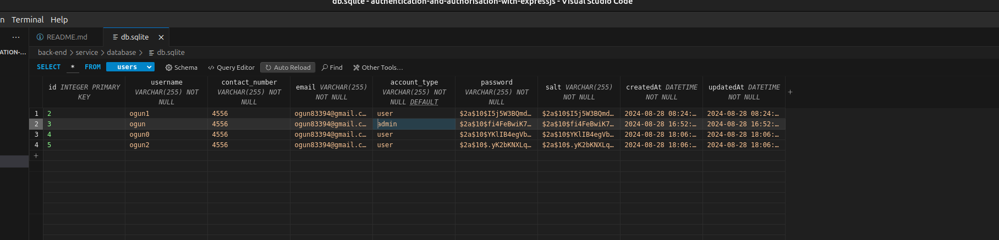
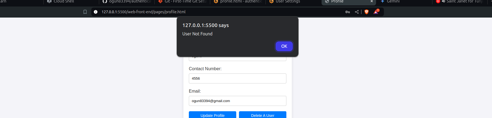
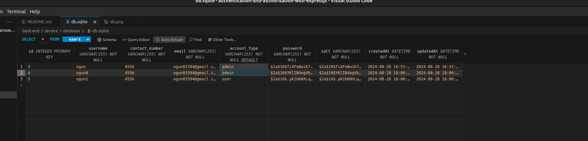

<h1 align="center">Authentication and Authorisation with Expressjs</h1>

<div align="center">

[]()
[](https://github.com/alibaba0010/authentication-and-authorisation-with-expressjs/issues)
[](https://github.com/kylelobo/The-Documentation-Compendium/pulls)
[](/LICENSE)

</div>

---

<p align="center"> This a StackUp Bounty Project on Authentication and Authorisation with Expressjs Project.
    <br> 
</p>

## 📝 Table of Contents

- [Bounty Challenge II](./back-end/README.md)
- [Getting Started](#getting_started)
- [Installation](#installation)
- [Delete User Functionality](#user-delete)
- [Author](#author)
- [Acknowledgment](#acknowledgement)

## 🏁 Getting Started <a name = "getting_started"></a>

These instructions will get you a copy of the project up and running on your local machine for development and testing purposes. See [deployment](#deployment) for notes on how to deploy the project on a live system.

## Prerequisites <a name = "installation"></a>

What things you need to install the software and how to install them.

```
1. Set Up Node.js Environment:

Verify Installation: Check if Node.js is installed by running node -v in your terminal.
Install Missing Node.js: If not installed, download and install Node.js from https://nodejs.org/en/download/package-manager.

```
```
2. Navigate to Project Directory:

Open Terminal: Open your terminal or command prompt.
Change Directory: Use the cd command to navigate to the "backend" folder of your project.
```
```
3. Install Project Dependencies:

Open Terminal: Ensure you're in the "backend" directory.
Install Packages: Run npm install to install the required dependencies listed in your package.json file.
Start Server: Once the installation is complete, run npm start to start the backend server.
```
```
4. Configure Code Editor:

Install Extensions: Open your code editor and install the following extensions:
SQLite3 Editor: For managing SQLite3 databases.
Live Server: For previewing HTML files in a local web server.
```
```
5. Open HTML File:

Locate File: Navigate to the "web-front-end/pages" directory and open the "index.html" file.
Start Live Server: Right-click on the "index.html" file and select the "Open with Live Server" option (or use a keyboard shortcut if available). This will launch a local web server and open the file in your default browser.
```


<h4 align="center">Server running</h4>

## Delete User Functionality <a name = "user-delete"></a>

The functionality added to the project


1. Initial Database content


2. User delete


3. Unabe to delete user


4. Delete after a user was deleted

## ✍️ Author <a name = "author"></a>

- [@ogun](https://github.com/ogun83394)

## 🎉 Acknowledgement <a name = "acknowledgement"></a>

- [Stackup](https://stackup.dev/)
